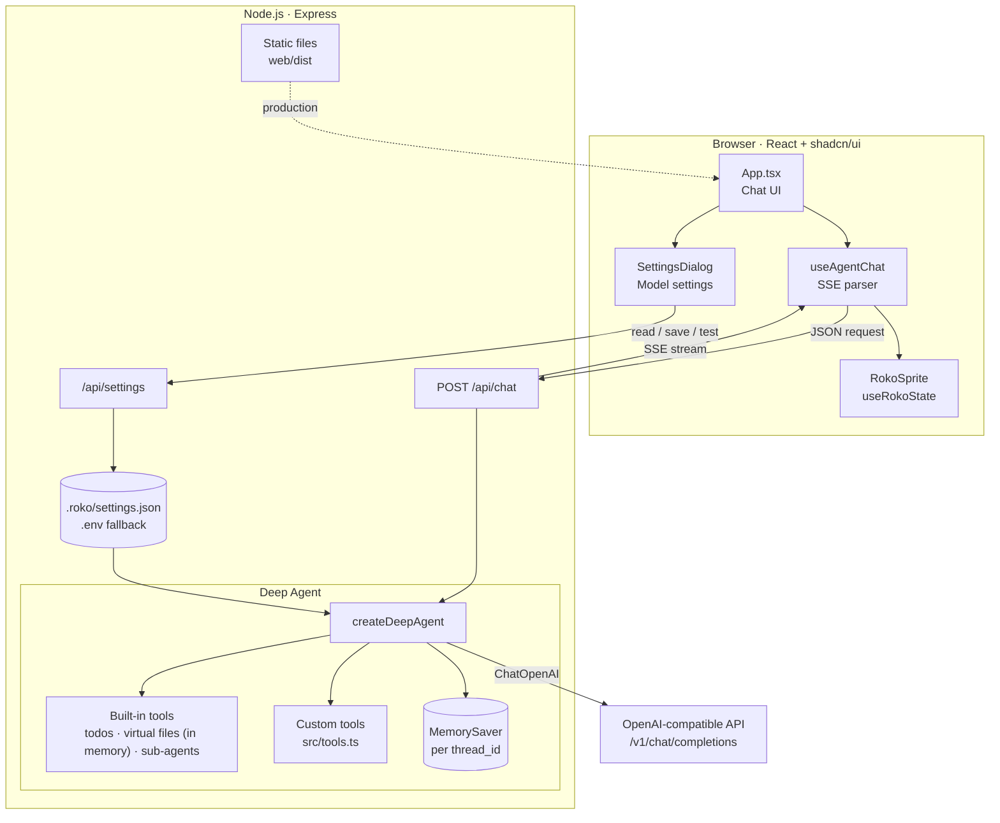
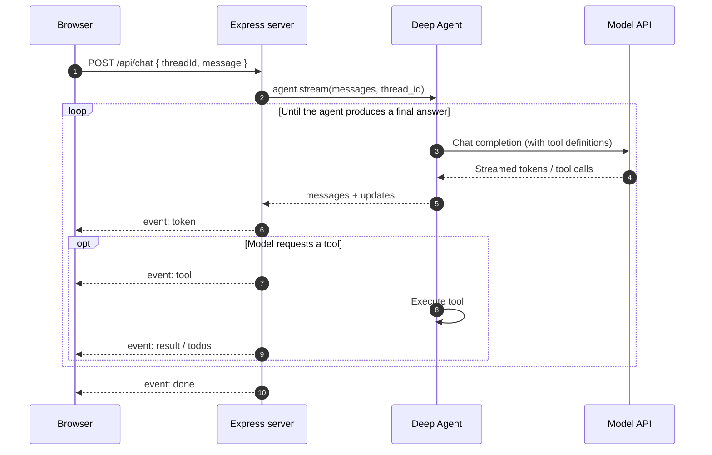

# Roko

A conversational agent built with TypeScript on [Deep Agents](https://github.com/langchain-ai/deepagentsjs), compatible with any OpenAI-compatible model API.

**English** · [繁體中文](README.zh-TW.md)

## Overview

Roko pairs a Deep Agents runtime with a web chat interface. The server runs the agent and streams every step to the browser through Server-Sent Events (SSE): response tokens, tool calls, tool results, and the agent's task list. Roko's animated mascot follows the agent's state.

### Features

- **Provider-agnostic models.** Works with any service that implements the OpenAI Chat Completions API, such as OpenAI, OpenRouter, Groq, DeepSeek, vLLM, or Ollama.
- **In-app model settings.** Configure the endpoint, API key, and model from the web interface. You can list available models and test the connection before saving. Changes apply without a restart.
- **Deep Agents runtime.** Includes task planning (`write_todos`), a virtual file system (`ls`, `read_file`, `write_file`, `edit_file`), and sub-agent delegation (`task`). Virtual files live in the conversation's state in memory; they are not written to disk and are cleared when the server restarts.
- **Custom tools.** Tools are declared with a [Zod](https://zod.dev) schema and registered in a single module.
- **Streaming UI.** Tokens, tool activity, and task lists render as they happen.
- **Conversation memory.** Context is kept per thread through a LangGraph checkpointer.
- **End-to-end TypeScript.** Express on the server; React, Vite, Tailwind CSS, and shadcn/ui in the browser.

## Architecture



### Request lifecycle



## Requirements

- Node.js 20.19 or later, or 22.12 or later (required by Vite)
- npm 10 or later
- An API key for an OpenAI-compatible service whose model supports **tool calling**

## Getting started

```bash
git clone https://github.com/Suckashi/Roko-Demo.git
cd Roko-Demo
npm install
```

### Development

```bash
npm run dev
```

This starts the Express API on port 3000 and the Vite dev server on port 5173, which proxies `/api` to the API. Open <http://localhost:5173>. On first launch, the **Model settings** dialog opens automatically. See [Configuration](#configuration).

### Production

```bash
npm run build           # builds the web client into web/dist
npm start               # serves the API and the client on one port
```

Open <http://localhost:3000>.

### Scripts

| Script | Description |
| --- | --- |
| `npm run dev` | Starts the API (with file watching) and the Vite dev server |
| `npm run build` | Builds the web client |
| `npm start` | Starts the server and serves the built client |
| `npm run typecheck` | Type-checks the server and the client |

## Configuration

### Model settings

Select the model button in the header to open **Model settings**:

| Field | Description |
| --- | --- |
| Provider | Presets that fill in the Base URL for common providers |
| Base URL | Base URL of the OpenAI-compatible API, for example `https://api.openai.com/v1` |
| API Key | Key for the provider. Once saved, it is never sent back to the browser; leave it blank to keep the current key |
| Model | Model identifier. **Fetch list** loads the provider's `GET /models` list, if the provider supports it |

**Test connection** sends a short request with the values in the form, without saving them. **Save** writes the settings to `.roko/settings.json` and applies them to the next message. Existing conversations are kept.

### Environment variables

Environment variables, or a `.env` file in the project root (see [`.env.example`](.env.example)), provide initial values. Settings saved in the interface take precedence over them.

| Variable | Default | Description |
| --- | --- | --- |
| `OPENAI_API_KEY` | — | Initial API key |
| `OPENAI_BASE_URL` | `https://api.openai.com/v1` | Initial Base URL |
| `MODEL_NAME` | — | Initial model identifier |
| `PORT` | `3000` | HTTP port for the server |
| `HOST` | `127.0.0.1` | Network interface the server listens on |
| `ROKO_DATA_DIR` | `.roko` | Directory for saved settings |

### Provider examples

| Provider | `OPENAI_BASE_URL` | `MODEL_NAME` |
| --- | --- | --- |
| OpenAI | `https://api.openai.com/v1` | `gpt-4o-mini` |
| OpenRouter | `https://openrouter.ai/api/v1` | `openai/gpt-4o-mini` |
| Groq | `https://api.groq.com/openai/v1` | `llama-3.3-70b-versatile` |
| DeepSeek | `https://api.deepseek.com/v1` | `deepseek-chat` |
| Ollama (local) | `http://localhost:11434/v1` | `qwen2.5:7b` |

Roko uses the Chat Completions endpoint (`useResponsesApi: false`), which most third-party providers support.

## Project structure

```
.
├── src/                          Server (Express)
│   ├── config.ts                 Server configuration
│   ├── settings.ts               Model settings: load, merge, persist
│   ├── agent.ts                  Deep Agent: model, tools, system prompt, checkpointer
│   ├── tools.ts                  Custom tool definitions
│   └── server.ts                 HTTP routes and SSE streaming
└── web/                          Client (npm workspace)
    ├── components.json           shadcn/ui configuration
    └── src/
        ├── App.tsx               Chat page
        ├── hooks/use-agent-chat.ts   SSE client and message state
        ├── components/chat/      Message bubbles and agent step cards
        ├── components/settings/  Model settings dialog
        ├── components/ui/        shadcn/ui components
        └── roko/                 Mascot sprite sheet, manifest, and component
```

## Customization

### Adding a tool

Define a tool in `src/tools.ts` and add it to the exported `tools` array:

```ts
export const getWeather = tool(
  async ({ city }) => `Sunny in ${city}`,
  {
    name: "get_weather",
    description: "Get the current weather for a city.",
    schema: z.object({ city: z.string() }),
  },
);

export const tools = [getCurrentTime, calculator, getWeather];
```

### Changing agent behavior

`src/agent.ts` holds the options passed to `createDeepAgent`. Change `systemPrompt` to change the agent's instructions. Add `subagents` to define specialized sub-agents. Replace `MemorySaver` with a persistent checkpointer if conversations must survive a restart. See the [Deep Agents documentation](https://docs.langchain.com/oss/javascript/deepagents/overview) for all options.

### Adding UI components

The client follows shadcn/ui conventions. Add components with the shadcn CLI:

```bash
cd web
npx shadcn@latest add dialog
```

## API reference

### Settings

| Method and path | Description |
| --- | --- |
| `GET /api/settings` | Returns the current settings. The API key is returned only as a masked hint |
| `PUT /api/settings` | Validates and saves `{ baseURL, apiKey, model }`. A blank `apiKey` keeps the current key |
| `POST /api/settings/test` | Sends a test request with the given settings and returns `{ ok, latencyMs }` or `{ ok, error }` |
| `POST /api/settings/models` | Returns `{ models }` from the provider's `GET /models` endpoint |

### `POST /api/chat`

Request body:

```json
{ "threadId": "string", "message": "string" }
```

Messages that share a `threadId` share conversation history. The response is a `text/event-stream`. Each event's `data` field is JSON:

| Event | Payload | Description |
| --- | --- | --- |
| `token` | `string` | A chunk of the model's response |
| `tool` | `{ name, args }` | The agent called a tool |
| `result` | `{ name, content }` | A tool returned a result (truncated to 500 characters) |
| `todos` | `[{ content, status }]` | The agent's task list was updated |
| `done` | `{}` | The run completed |
| `error` | `{ message }` | The run failed |

If the client closes the connection, the server cancels the agent run.

## Security

- By default, the server listens on `127.0.0.1` only. The settings API can read and replace the API key and has no authentication, so do not expose the server to other machines (`HOST=0.0.0.0`) unless it sits behind your own access control.
- Saved settings, including the API key, are stored in plain text in `.roko/settings.json` with file mode `0600`. The `.roko/` directory is listed in `.gitignore`.
- The agent's file tools operate on an in-memory virtual file system. They do not read or write the host file system.

## Mascot

Roko's animation reflects the agent's state:

| Agent state | Animation |
| --- | --- |
| Idle | `idle` |
| Waiting for the model | `waiting` |
| Running a tool | `running` |
| Streaming a response | `review` |
| Run completed | `jumping` (plays once) |
| Error | `failed` |

The mapping lives in `web/src/roko/use-roko-state.ts`. When the user has turned on *reduced motion* in their system settings, only a static frame is shown.

## License

The Roko artwork in `web/src/roko/` is provided by its author for use in this project only. It is not covered by any code license, and no reuse license is granted. See [`web/src/roko/README.md`](web/src/roko/README.md) for details.
