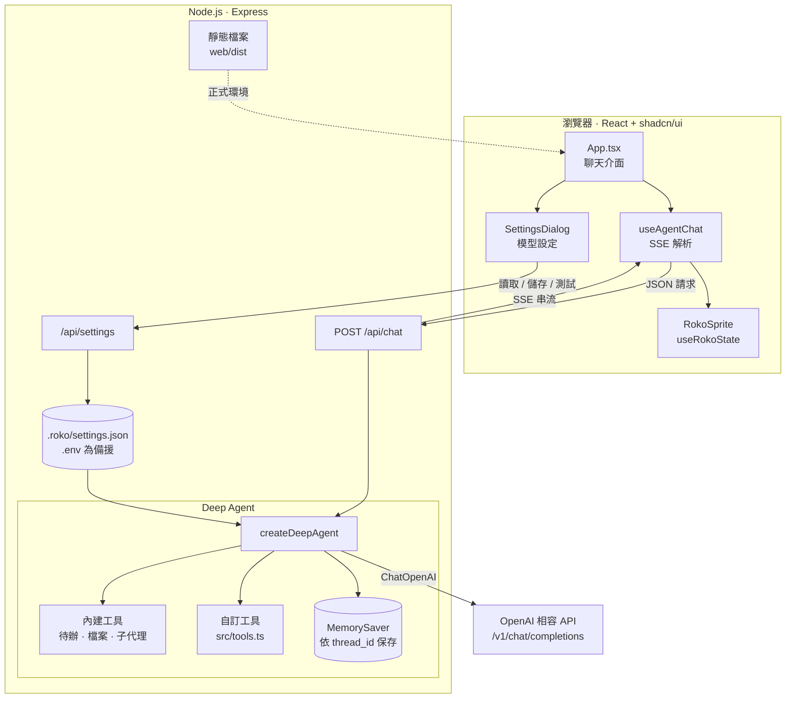
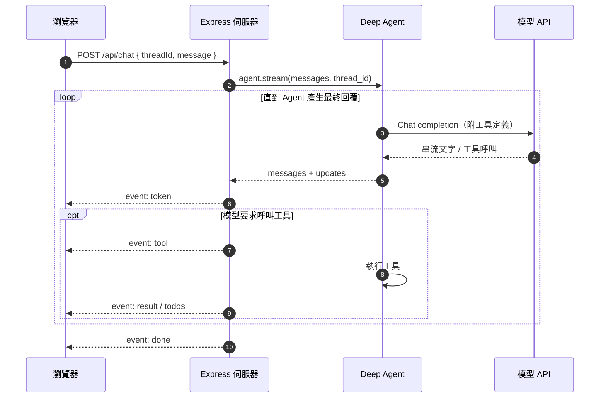

# Roko

以 TypeScript 與 [Deep Agents](https://github.com/langchain-ai/deepagentsjs) 打造的對話式 Agent，可串接任何 OpenAI 相容的模型 API。

[English](README.md) · **繁體中文**

## 概述

Roko 由 Deep Agents 執行環境與網頁聊天介面組成。伺服器負責執行 Agent，並以 Server-Sent Events（SSE）將每個步驟即時推送到瀏覽器，包括回覆內容、工具呼叫、工具結果與 Agent 的待辦清單。介面中的 Roko 吉祥物動畫會隨 Agent 狀態變化。

### 功能

- **不綁定模型供應商**：支援任何實作 OpenAI Chat Completions API 的服務，例如 OpenAI、OpenRouter、Groq、DeepSeek、vLLM 或 Ollama。
- **介面內設定模型**：可直接在網頁上設定端點、API 金鑰、模型與溫度，儲存前可先取得模型清單並測試連線；變更立即生效，不需重新啟動。
- **Deep Agents 執行環境**：內建任務規劃（`write_todos`）、虛擬檔案系統（`ls`、`read_file`、`write_file`、`edit_file`）與子代理委派（`task`）。
- **自訂工具**：以 [Zod](https://zod.dev) schema 宣告工具，集中在單一模組註冊。
- **即時串流介面**：回覆文字、工具活動與待辦清單會在產生的同時顯示。
- **對話記憶**：透過 LangGraph checkpointer 依對話串（thread）保存上下文。
- **前後端皆為 TypeScript**：伺服器使用 Express；前端使用 React、Vite、Tailwind CSS 與 shadcn/ui。

## 系統架構



### 請求流程



## 系統需求

- Node.js 20 以上
- npm 10 以上
- OpenAI 相容服務的 API 金鑰，且所用模型須支援 **tool calling**

## 快速開始

```bash
git clone https://github.com/Suckashi/Roko-Demo.git
cd Roko-Demo
npm install
```

### 開發模式

```bash
npm run dev
```

這會在 3000 埠啟動 Express API，在 5173 埠啟動 Vite 開發伺服器，Vite 會將 `/api` 轉送給 API。請開啟 <http://localhost:5173>。首次啟動時會自動開啟「模型設定」視窗，詳見[設定](#設定)。

### 正式環境

```bash
npm run build           # 將前端打包至 web/dist
npm start               # 以單一埠提供 API 與前端
```

請開啟 <http://localhost:3000>。

### 指令

| 指令 | 說明 |
| --- | --- |
| `npm run dev` | 啟動 API（監看檔案變更）與 Vite 開發伺服器 |
| `npm run build` | 打包前端 |
| `npm start` | 啟動伺服器並提供已打包的前端 |
| `npm run typecheck` | 對伺服器與前端進行型別檢查 |

## 設定

### 模型設定

點選頁首的模型按鈕即可開啟「模型設定」：

| 欄位 | 說明 |
| --- | --- |
| 供應商 | 常用供應商的預設值，點選後自動填入 Base URL |
| Base URL | OpenAI 相容 API 的 Base URL，例如 `https://api.openai.com/v1` |
| API Key | 供應商的 API 金鑰。儲存後不會再傳回瀏覽器；留空表示沿用目前的金鑰 |
| 模型 | 模型名稱。「取得清單」會讀取供應商的 `GET /models` 清單（需供應商支援） |
| Temperature | 取樣溫度（0–2） |

「測試連線」會以表單中的值送出一次簡短請求，但不會儲存；「儲存」會將設定寫入 `.roko/settings.json`，並套用至下一則訊息，既有對話會保留。

### 環境變數

環境變數或專案根目錄的 `.env` 檔（參考 [`.env.example`](.env.example)）提供初始值；在介面中儲存的設定優先於環境變數。

| 變數 | 預設值 | 說明 |
| --- | --- | --- |
| `OPENAI_API_KEY` | — | 初始 API 金鑰 |
| `OPENAI_BASE_URL` | `https://api.openai.com/v1` | 初始 Base URL |
| `MODEL_NAME` | — | 初始模型名稱 |
| `TEMPERATURE` | `0.3` | 初始取樣溫度 |
| `PORT` | `3000` | 伺服器的 HTTP 埠號 |
| `HOST` | `127.0.0.1` | 伺服器監聽的網路介面 |
| `ROKO_DATA_DIR` | `.roko` | 設定檔的儲存目錄 |

### 供應商設定範例

| 供應商 | `OPENAI_BASE_URL` | `MODEL_NAME` |
| --- | --- | --- |
| OpenAI | `https://api.openai.com/v1` | `gpt-4o-mini` |
| OpenRouter | `https://openrouter.ai/api/v1` | `openai/gpt-4o-mini` |
| Groq | `https://api.groq.com/openai/v1` | `llama-3.3-70b-versatile` |
| DeepSeek | `https://api.deepseek.com/v1` | `deepseek-chat` |
| Ollama（本機） | `http://localhost:11434/v1` | `qwen2.5:7b` |

Roko 使用 Chat Completions 端點（`useResponsesApi: false`），大多數第三方供應商都支援此端點。

## 專案結構

```
.
├── src/                          伺服器（Express）
│   ├── config.ts                 伺服器設定
│   ├── settings.ts               模型設定：讀取、合併、儲存
│   ├── agent.ts                  Deep Agent：模型、工具、系統提示詞、checkpointer
│   ├── tools.ts                  自訂工具定義
│   └── server.ts                 HTTP 路由與 SSE 串流
└── web/                          前端（npm workspace）
    ├── components.json           shadcn/ui 設定
    └── src/
        ├── App.tsx               聊天頁面
        ├── hooks/use-agent-chat.ts   SSE 用戶端與訊息狀態
        ├── components/chat/      訊息泡泡與 Agent 步驟卡片
        ├── components/settings/  模型設定視窗
        ├── components/ui/        shadcn/ui 元件
        └── roko/                 吉祥物 sprite sheet、manifest 與元件
```

## 自訂

### 新增工具

在 `src/tools.ts` 定義工具，並加入匯出的 `tools` 陣列：

```ts
export const getWeather = tool(
  async ({ city }) => `${city}：晴天`,
  {
    name: "get_weather",
    description: "查詢城市目前的天氣。",
    schema: z.object({ city: z.string() }),
  },
);

export const tools = [getCurrentTime, calculator, getWeather];
```

### 調整 Agent 行為

`src/agent.ts` 存放傳給 `createDeepAgent` 的選項。修改 `systemPrompt` 可調整 Agent 的指示；加入 `subagents` 可定義專責的子代理；若對話需在伺服器重啟後保留，請將 `MemorySaver` 換成持久化的 checkpointer。完整選項請參閱 [Deep Agents 文件](https://docs.langchain.com/oss/javascript/deepagents/overview)。

### 新增介面元件

前端遵循 shadcn/ui 慣例，可用 shadcn CLI 新增元件：

```bash
cd web
npx shadcn@latest add dialog
```

## API 參考

### 設定

| 方法與路徑 | 說明 |
| --- | --- |
| `GET /api/settings` | 回傳目前設定，API 金鑰僅以遮罩提示回傳 |
| `PUT /api/settings` | 驗證並儲存 `{ baseURL, apiKey, model, temperature }`；`apiKey` 留空表示沿用目前的金鑰 |
| `POST /api/settings/test` | 以指定設定送出測試請求，回傳 `{ ok, latencyMs }` 或 `{ ok, error }` |
| `POST /api/settings/models` | 從供應商的 `GET /models` 端點回傳 `{ models }` |

### `POST /api/chat`

請求內容：

```json
{ "threadId": "string", "message": "string" }
```

使用相同 `threadId` 的訊息會共用對話紀錄。回應格式為 `text/event-stream`，每個事件的 `data` 欄位為 JSON：

| 事件 | 內容 | 說明 |
| --- | --- | --- |
| `token` | `string` | 模型回覆的文字片段 |
| `tool` | `{ name, args }` | Agent 呼叫了工具 |
| `result` | `{ name, content }` | 工具回傳結果（截斷至 500 字元） |
| `todos` | `[{ content, status }]` | Agent 的待辦清單已更新 |
| `done` | `{}` | 執行完成 |
| `error` | `{ message }` | 執行失敗 |

用戶端中斷連線時，伺服器會取消該次 Agent 執行。

## 安全性

- 伺服器預設只監聽 `127.0.0.1`。設定 API 可讀取並替換 API 金鑰，且沒有身分驗證，因此除非另有存取控管，請勿將伺服器開放給其他機器（`HOST=0.0.0.0`）。
- 儲存的設定（含 API 金鑰）以明文存放於 `.roko/settings.json`，檔案權限為 `0600`；`.roko/` 已列入 `.gitignore`。
- Agent 的檔案工具操作的是記憶體中的虛擬檔案系統，不會讀寫主機上的檔案。

## 吉祥物

Roko 的動畫反映 Agent 的狀態：

| Agent 狀態 | 動畫 |
| --- | --- |
| 待命 | `idle` |
| 等待模型回應 | `waiting` |
| 執行工具 | `running` |
| 串流輸出回覆 | `review` |
| 執行完成 | `jumping`（播放一次） |
| 發生錯誤 | `failed` |

對應邏輯位於 `web/src/roko/use-roko-state.ts`。若使用者在系統設定中開啟「減少動態效果」，則只顯示靜態畫格。

## 授權

`web/src/roko/` 中的 Roko 美術素材由作者提供，僅限本專案使用，不適用任何程式碼授權，也未授予再利用許可。詳見 [`web/src/roko/README.md`](web/src/roko/README.md)。
